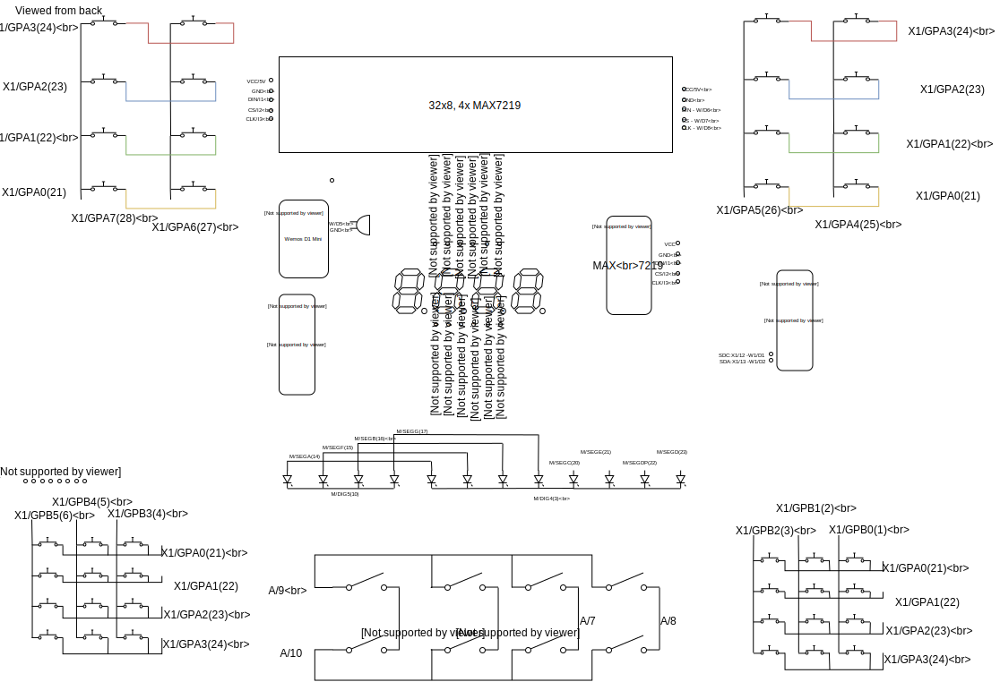

# Switchery
A home toy project for kids, based on Wemos D1 Mini (Arduino)

## Components
* Core stuff 
  * Wemos D1 Mini - ESP8266 Arduino platform with Wifi support
  * 2x MCP23017 16-bit multiplexers
  * 4x8x8 MAX7219 based led matrix, providing an 32x8 pixel screen
  * An additional MAX7219
* Human interface
  * A 4x7 segment display
  * 12 leds in a row
  * 2*2*4 fancy colorful pushbuttons
  * 2x 3x4 numpads
  * 2x4 switches
  * A buzzer

## Component pinouts
(For the record and fast access for myself :) )

| - | - | MCP23017 | - | - |
| ---- | ---- | --- | --- | --- |
| GPB0 | 1 | | 28 | GPA7 |
| GPB1 | 2 | | 27 | GPA6 |
| GPB2 | 3 | | 26 | GPA5 |
| GPB3 | 4 | | 25 | GPA4 |
| GPB4 | 5 | | 24 | GPA3 |
| GPB5 | 6 | | 23 | GPA2 |
| GPB6 | 7 | | 22 | GPA1 |
| GPB7 | 8 | | 21 | GPA0 |
| Vdd | 9 | | 20 | INTA |
| Vss | 10 | | 19 | INTB |
| NC | 11 | | 18 | ¬RESET |
| SCL | 12 | | 17 | A2 |
| SDA | 13 | | 16 | A1 |
| NC | 14 | | 15 | A0 |

|||MAX7219|||
|-|-|-|-|-|
|DIN|1||24|DOUT|
|DIG0|2||23|SEGD|
|DIG4|3||22|SEGDP|
|GND|4||21|SEGE|
|DIG6|5||20|SEGC|
|DIG2|6||19|V+|
|DIG3|7||18|ISET|
|DIG7|8||17|SEGG|
|GND|9||16|SEGB|
|DIG5|10||15|SEGF|
|DIG1|11||14|SEGA|
|LOAD/¬CS|12||13|CLK|

|7|se|gm|en|t|-|
|-|-|-|-|-|-|-|
|D1|A|F|D2|D3|B|
|12|11|10|9|8|7|
|-|-|-|-|-|-|
|1|2|3|4|5|6|
|E|D|DP|C|G|D4|

## Wiring

([Edit](https://drive.google.com/file/d/1ygxo5pzyNBqcTJ3JTJQE1Ou09688x8HK/view?usp=sharing))
